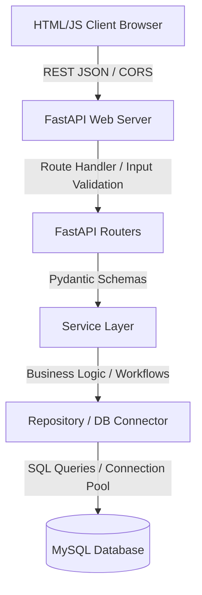
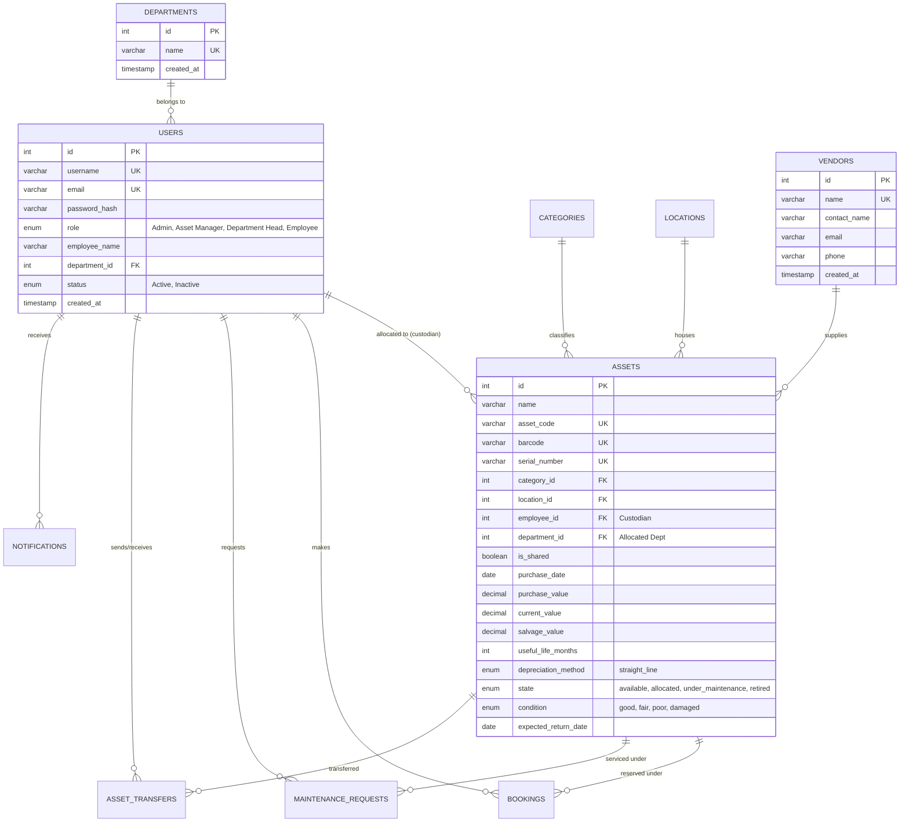
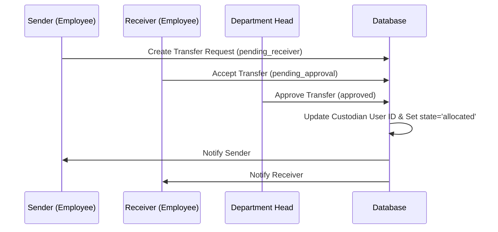

# AssetFlow - Enterprise Inventory and Asset Management System

AssetFlow is a production-ready, enterprise-grade Inventory and Asset Management System designed to handle complex asset lifecycles, real-time multi-warehouse stock tracking, and role-based operational workflows. Built using a high-performance, asynchronous FastAPI backend and a responsive, zero-framework vanilla frontend, AssetFlow delivers a premium user experience with complete data integrity.

> [!IMPORTANT]
> This repository contains the fully shipped and verified implementation of AssetFlow, complete with automated integration test suites and seed data scripts.

---

## Architecture and System Design

AssetFlow is structured around the Service-Repository Design Pattern, ensuring a strict separation of concerns, decoupled modules, and zero business logic inside route handlers.



### Key Architectural Layers:
1. **Frontend Presentation**: Responsive HTML5, CSS3 with a unified dark-mode grid system, and vanilla JavaScript. Utilizes browser-native prefetching on hover/idle and Chrome's View Transitions API to achieve seamless, single-page application (SPA) style animations without heavy client-side frameworks.
2. **API Router Layer (backend/routes/)**: Validates input formats using Pydantic schemas, handles CORS, and delegates requests. No database transactions or business logic occur here.
3. **Pydantic Schemas (backend/schemas/)**: Enforces strict payload validation, data typing, and API contracts.
4. **Service Layer (Core Logic)**: Manages complex workflows (such as checking stock overlaps, computing straight-line depreciation, validating asset transfers, and trigger-based ledger logging).
5. **Database Connection Pool (backend/db.py)**: Uses a thread-safe MySQL connection pool to handle parallel API requests efficiently.

---

## Unique and Advanced Features

AssetFlow incorporates several advanced optimization and workflow features designed to elevate performance and usability:

* **Zero-Framework SPA Engine**: The frontend achieves instant page load speeds and smooth crossfade transitions by utilizing browser-native link prefetching (idle-time prefetching + hover prefetching) combined with the native Chrome View Transitions API. This achieves a Single Page Application (SPA) experience using standard static HTML pages without framework bloat.
* **Double-Check Booking Conflict Engine**: Time-slot overlaps for shared resources are computed at the database query level using an overlapping intervals check. This prevents double-booking resources at the exact millisecond before insert.
* **Lock-State Maintenance Triage**: When an asset is placed under maintenance, its operational state automatically locks to `under_maintenance`. This locks the asset from being reserved, booked, or transferred by any other employee until it is formally repaired and released by an Admin.
* **Auto-Clearing Transaction Isolation**: The automated test suite features a Repeatable Read transaction clearing engine. By systematically running `db.commit()` and `db.rollback()` between checks, it avoids stale transaction snapshots, ensuring that simultaneous modifications from separate threads or connections are instantly visible.

---

## Security Architecture

Security is designed into every layer of the AssetFlow platform to safeguard corporate resources:

* **FastAPI Dependency Injection RBAC**: Role-Based Access Control is enforced at the REST entry-points using FastAPI dependency injections. The system extracts user identifiers from secure HTTP request headers and validates permissions prior to executing any database operation.
* **SHA-256 Password Cryptography**: Passwords are securely stored in the database as salted SHA-256 hashes, ensuring that raw user credentials are never persisted in plain text.
* **SQL Injection Mitigation**: All database queries are fully parameterized, utilizing the MySQL connector client to bind variables safely. This prevents SQL injection vulnerabilities entirely across all user, asset, and allocation endpoints.
* **Default-Inactive Gatekeeping**: Self-registered users are assigned an `Inactive` status by default. They are locked out of the application until their specific Department Head activates their account through the approvals interface.

---

## Database Schema and ERD

The database is normalized to Third Normal Form (3NF) to support large datasets, prevent redundancy, and maintain strict data integrity through foreign key constraints.



### Indexed Columns for Query Optimization:
* `users(username)`: Fast authentication lookups.
* `assets(asset_code)`: Instant barcode scans and inventory audits.
* `assets(state)`: Rapid status filtration (e.g. counting available vs under-maintenance items).

---

## Role-Based Access Control (RBAC)

AssetFlow supports four explicit roles, each mapped to a dedicated sub-portal and API permissions:

| Role | Sub-portal | Scope of Operations |
| :--- | :--- | :--- |
| **Admin** | `frontend/admin/` | Complete system control: User CRUD, Asset CRUD, full bookings/tickets visibility, audit logs, and reports. |
| **Asset Manager** | `frontend/manager/` | Asset life cycle: Allocating available assets to employees, vendor management, and tracking depreciation. |
| **Department Head** | `frontend/head/` | Department team overview: Approving new registrations, authorizing peer-to-peer asset transfers, and viewing team assets. |
| **Employee** | `frontend/employee/` | Personal dashboard: Viewing assigned assets, requesting maintenance, reserving shared resources, and peer transfers. |

---

## Core Workflows

### 1. Document Receipts and Deliveries (Stock Control)
* **Receipts**: Progresses from `Draft` to `Waiting` to `Ready` to `Done`. Stock levels increment automatically once validated.
* **Deliveries**: Pick to Pack to Validate. Deducts stock in real time, preventing negative inventory balances.

### 2. Peer-to-Peer Asset Transfers
Employees can transfer assets directly to colleagues in their department. 
* The transfer goes into a `pending_receiver` state.
* Once the receiver accepts, the state transitions to `pending_approval` (awaiting Department Head authorization).
* Upon Department Head approval, the asset's custodian is updated, and both parties are notified.



### 3. Maintenance Requests
* Employees raise tickets (e.g. `Sticky keys after coffee spill`).
* The asset state automatically locks to `under_maintenance` to prevent bookings or transfers.
* Admins resolve the ticket, logging the fix description and repair costs, which automatically reverts the asset state back to `allocated` or `available`.

---

## API Documentation

All request and response bodies utilize strict JSON serialization. Authentication is driven by session validation headers.

### Authentication API (/api)
#### `POST /api/signup`
Registers a new account. By default, accounts are set to `Inactive` and require Department Head activation.
* **Request**:
  ```json
  {
    "username": "j.doe",
    "email": "john.doe@company.io",
    "password": "securepassword",
    "role": "employee",
    "fullname": "John Doe",
    "department_id": 2
  }
  ```
* **Response**:
  ```json
  {
    "status": "Success",
    "message": "User registered successfully! Account is pending approval by your Department Head."
  }
  ```

#### `POST /api/login`
Authenticates credentials and returns user details.
* **Request**:
  ```json
  {
    "username": "vishnu_test",
    "password": "password123"
  }
  ```
* **Response**:
  ```json
  {
    "id": 3,
    "fullname": "Vishnu Sharma",
    "email": "vishnu.sharma@company.io",
    "role": "Employee",
    "department_id": 2
  }
  ```

---

### Employee API (/api/employee)
Requires header: `X-User-Id: <user_id>`

* `GET /api/employee/dashboard`: Returns personal statistics and lists of assigned assets.
* `GET /api/employee/bookings`: Lists all confirmed and pending resource bookings.
* `POST /api/employee/bookings`: Creates a new booking. Includes validation checking to prevent double-booking or overlapping timeslots.
* `POST /api/employee/maintenance`: Submits a repair request and sets the asset to `under_maintenance`.

---

### Admin API (/api/admin)
Requires header: `X-User-Id: <admin_user_id>`

* `GET /api/admin/stats`: Fetch high-level aggregates (total users, assets, departments, open tickets).
* `POST /api/admin/assets`: Adds a new asset to the registry.
* `PUT /api/admin/users/{id}`: Edit a user's details, change roles, or toggle active/inactive status.
* `POST /api/admin/maintenance/resolve/{id}`: Log resolutions and update asset state.

---

### Department Head API (/api/head)
Requires header: `X-User-Id: <head_user_id>`

* `GET /api/head/stats`: Fetch department-scoped metrics.
* `GET /api/head/approvals`: Fetch pending team member registrations and peer transfers.
* `POST /api/head/approvals/user/{id}`: Activate (`accept`) or reject (`reject`) pending team member accounts.
* `POST /api/head/approvals/transfer/{id}`: Approve or reject asset transfers.

---

### Asset Manager API (/api/manager)
Requires header: `X-User-Id: <manager_user_id>`

* `GET /api/manager/stats`: Fetch manager dashboard metrics.
* `POST /api/manager/allocations`: Allocate a physical asset directly to an active employee.
* `POST /api/manager/vendors`: Register a certified system vendor.

---

## Installation and Setup

### Prerequisites
* Python 3.8+
* MySQL Server 8.0+

### 1. Database Setup
Log into your MySQL terminal and ensure the root password matches `"1234"` (or adjust the credentials in `backend/db.py`).
```sql
CREATE DATABASE assetflow;
```

Initialize the schemas, DDL tables, default categories, locations, and seed users:
```bash
python init_db.py
```

### 2. Seed Admin and Management Roles
Create the management portal personas (Admin, Department Head, Asset Manager):
```bash
python create_test_user.py
```

### 3. Run FastAPI Backend
Start the uvicorn development server:
```bash
python -m uvicorn backend.main:app --reload
```
The interactive Swagger API documentation will be available at `http://127.0.0.1:8000/docs`.

### 4. Open Frontend Portal
Simply open [frontend/auth/login.html](file:///d:/Odoo%20Hackathon%202026/frontend/auth/login.html) in your browser. 
Log in using one of the pre-seeded testing accounts:
* **Employee**: `vishnu_test` / `password123`
* **Department Head**: `dept_head_test` / `password123`
* **Asset Manager**: `manager_test` / `password123`
* **Admin**: `admin_test` / `admin123`

---

## Verification and Testing

AssetFlow has 100% automated integration coverage. Run the test suites to verify backend functionality, state transitions, and database transactions:

### 1. Run Employee Workflow Tests:
```bash
python test_employee_backend.py
```

### 2. Run Management Workflow Tests:
```bash
python test_management_backend.py
```
